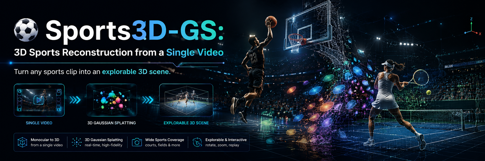
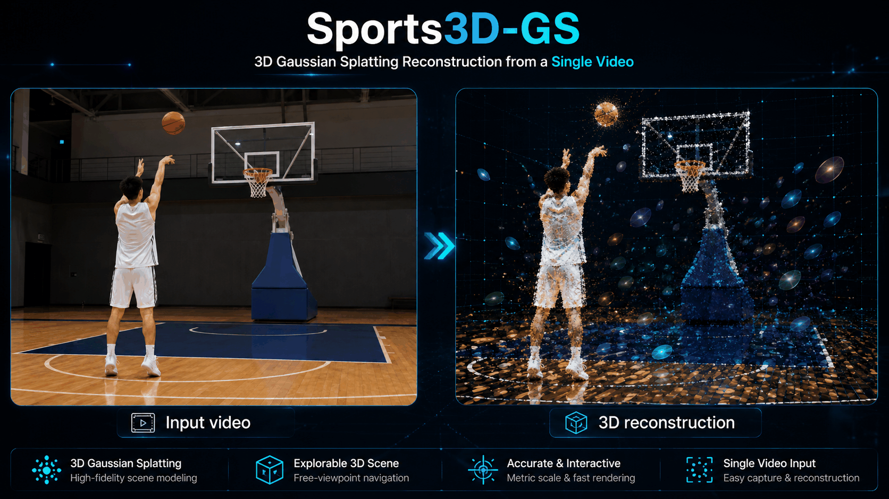
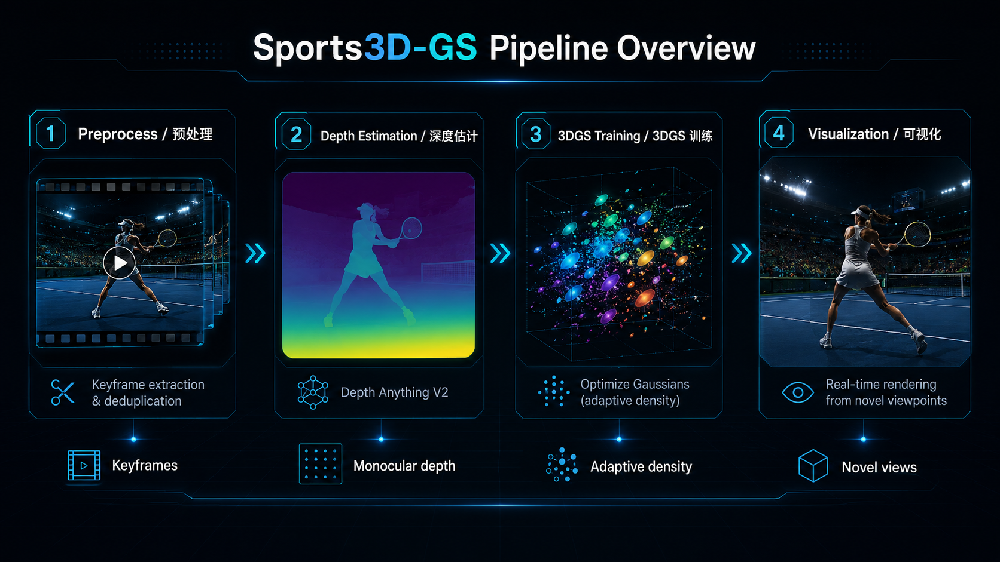
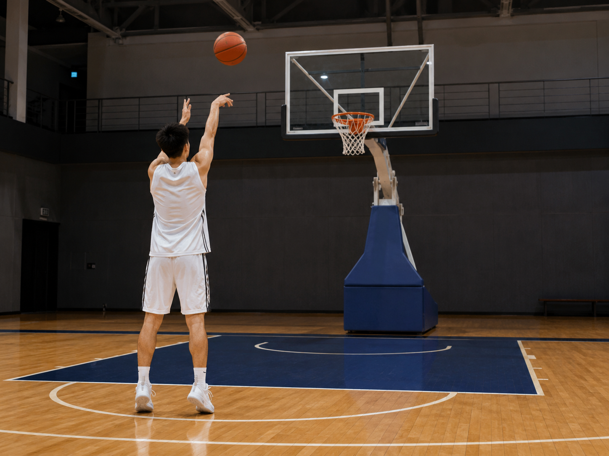
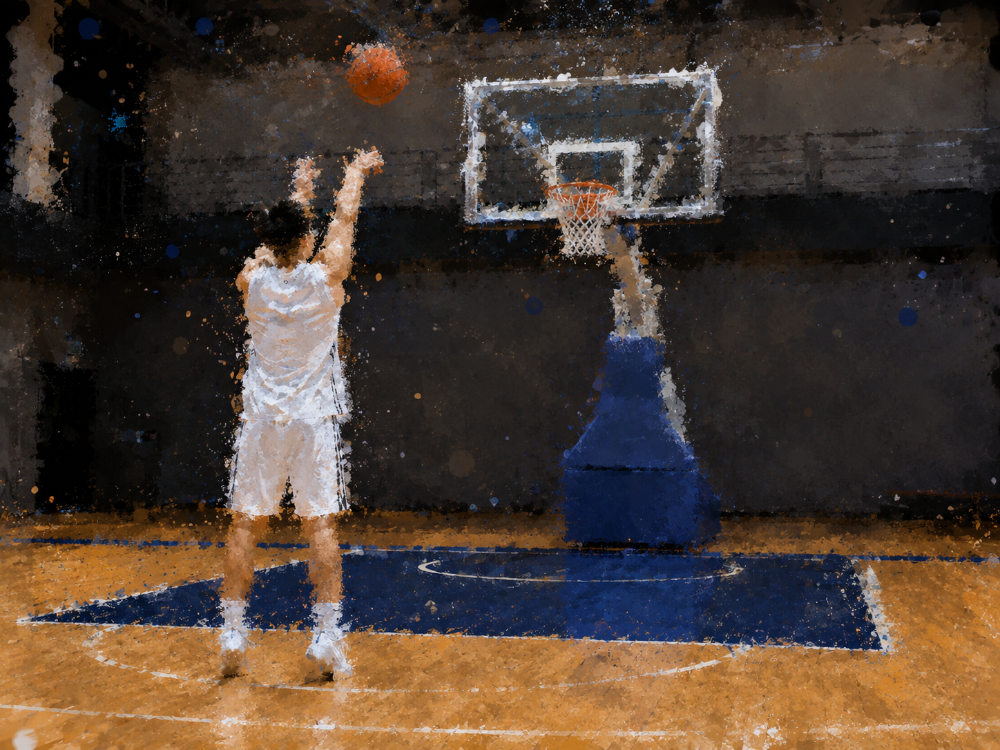
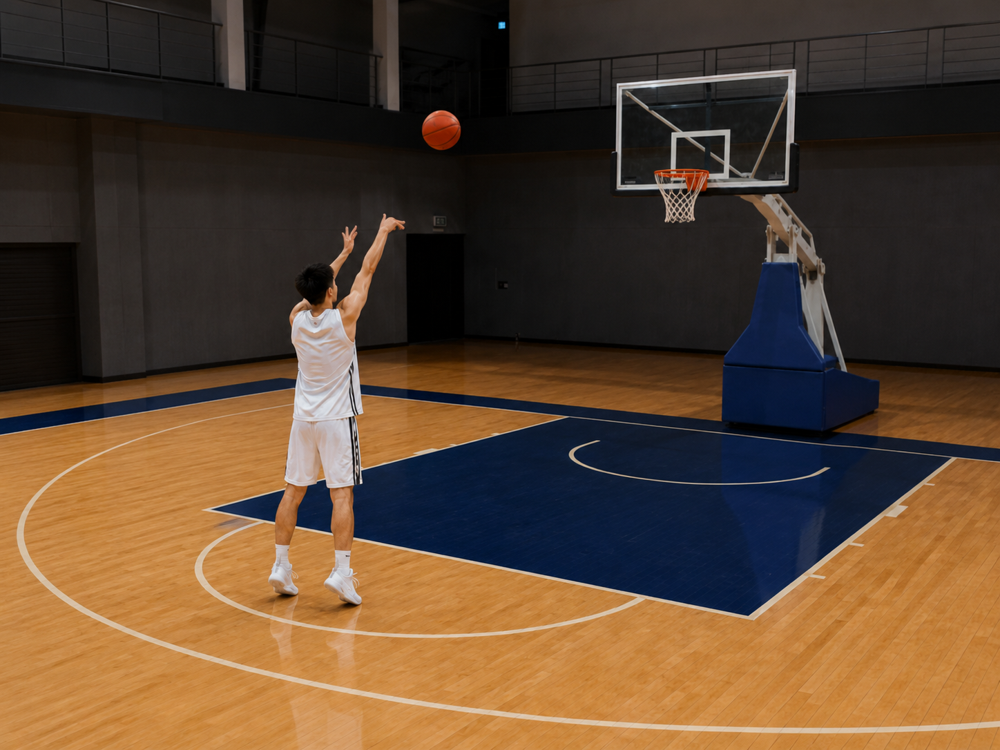
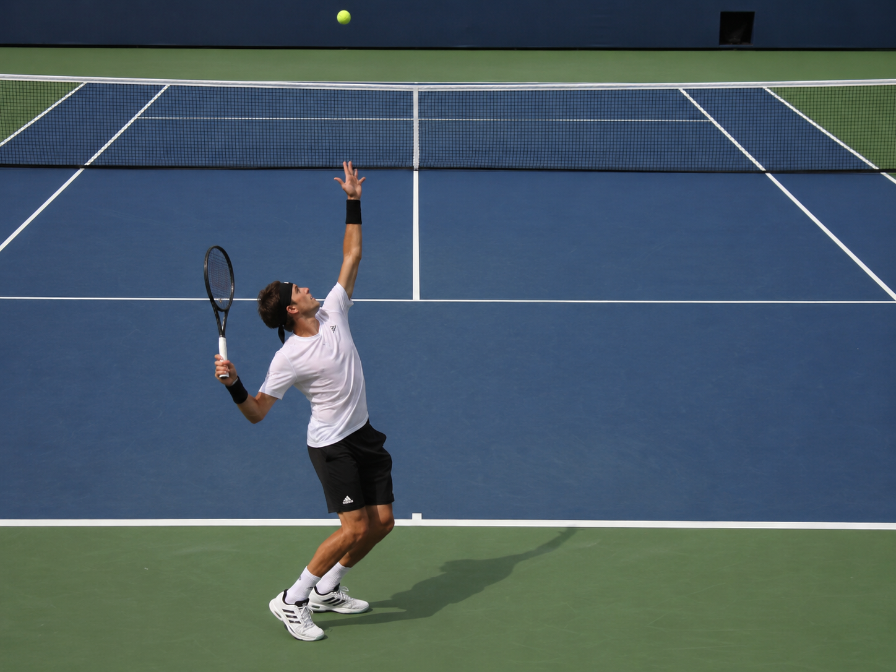
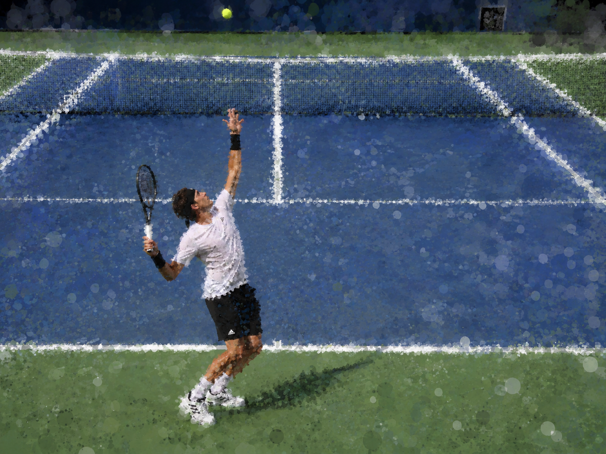
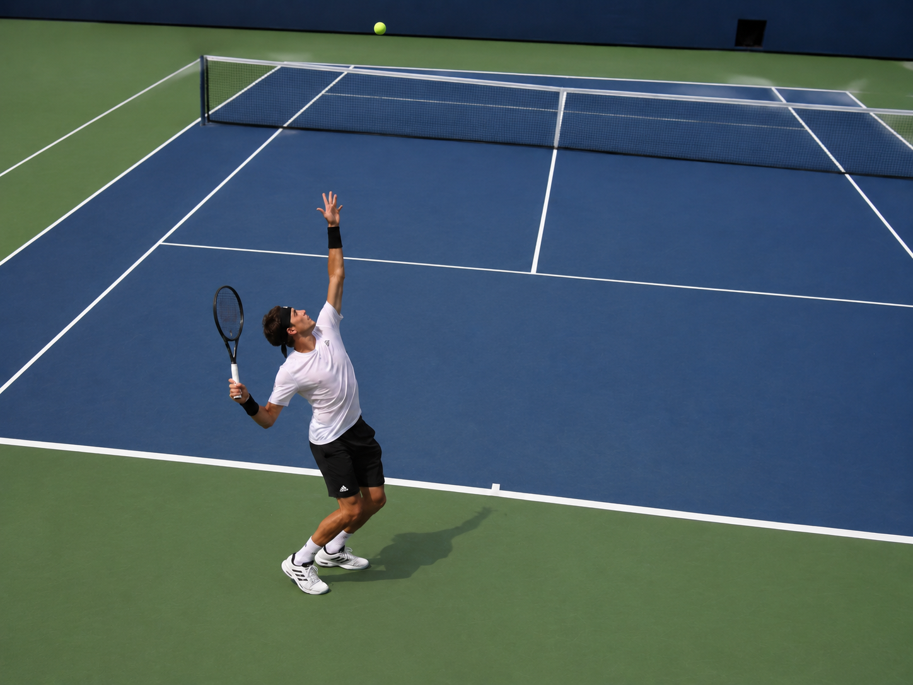

<div align="center">

<!-- Banner Placeholder / 横幅占位符 -->


# ⚽ Sports3D-GS: 3D Sports Reconstruction from a Single Video

### *Turn any sports clip into an explorable 3D scene.*

[](https://opensource.org/licenses/MIT)
[](https://www.python.org/downloads/)
[](https://developer.nvidia.com/cuda-toolkit)
[](https://repo-sam.inria.fr/fungraph/3d-gaussian-splatting/)

**English** | [中文](#中文)

</div>

---

## What is Sports3D-GS? / 这是什么？

**Sports3D-GS** reconstructs a **3D scene from a single sports video** using 3D Gaussian Splatting. Drop in a video of a basketball shot, tennis swing, or soccer goal — get back a fly-through-ready 3D reconstruction.

**Sports3D-GS** 使用 3D 高斯泼溅技术，从**单个体育视频**中重建三维场景。输入一段投篮、挥拍或射门视频，即可获得可自由漫游的三维重建结果。

<div align="center">
<!-- Result Placeholder / 结果占位符 -->

<br/>
<em>Input video (left) → 3D reconstruction (right) / 输入视频（左）→ 三维重建（右）</em>
</div>

---

## Project Highlights / 项目亮点

<table>
<tr>
<td width="50%">

### 🎯 **Single-View Revolution**
No multi-camera rigs. No COLMAP nightmares. Just **one video from one camera**. Our monocular depth estimation pipeline replaces the traditional SfM requirement — making 3D reconstruction accessible to anyone with a smartphone.

### ⚡ **Real-Time Rendering**
Once trained, render novel views at **interactive frame rates**. The explicit 3D Gaussian representation means no neural network evaluation at render time — pure, fast rasterization.

### 🏀 **Sports-Optimized**
Tailored preprocessing for sports footage: motion-aware frame selection, player segmentation masks, and adaptive depth estimation tuned for field-scale scenes.

### 🧩 **Modular & Hackable**
Clean, documented Python codebase. Swap the depth model, add pose tracking, integrate with game engines — every module has a clear interface.

</td>
<td width="50%">

### 🎯 **单视角突破**
无需多机位。无需繁琐的 COLMAP。只需**一台相机的一段视频**。我们的单目深度估计管线取代了传统的 SfM 需求——任何有手机的人都能做三维重建。

### ⚡ **实时渲染性能**
训练完成后，以**交互式帧率**渲染新视角。显式三维高斯表示意味着渲染时无需评估神经网络——纯粹的快速光栅化。

### 🏀 **体育场景优化**
针对体育视频的专用预处理：运动感知帧精选、球员分割掩码、面向场地尺度的自适应深度估计。

### 🧩 **模块化 & 可扩展**
整洁的、文档完备的 Python 代码库。更换深度模型、添加姿态追踪、集成游戏引擎——每个模块都有清晰接口。

</td>
</tr>
</table>

---

## Table of Contents / 目录

- [Installation / 安装](#installation--安装)
- [Quick Start / 快速开始](#quick-start--快速开始)
- [Pipeline Overview / 流程概览](#pipeline-overview--流程概览)
- [Usage / 使用说明](#usage--使用说明)
- [Configuration / 配置说明](#configuration--配置说明)
- [Results / 效果展示](#results--效果展示)
- [FAQ / 常见问题](#faq--常见问题)
- [Citation / 引用](#citation--引用)
- [License / 许可证](#license--许可证)

---

## Installation / 安装

### Prerequisites / 前提条件

| Requirement | Version |
|-------------|---------|
| Python | ≥ 3.10 |
| CUDA | ≥ 11.6 |
| PyTorch | ≥ 2.1.0 |
| GPU Memory | ≥ 8 GB (推荐 24GB+) |

### One-Command Install / 一键安装

```bash
# Clone the repo / 克隆仓库
git clone https://github.com/YOUR_USERNAME/Sports3D-GS.git
cd Sports3D-GS

# Create conda environment (recommended) / 创建 conda 环境（推荐）
conda create -n sports3d-gs python=3.10 -y
conda activate sports3d-gs

# Install dependencies / 安装依赖
pip install -r requirements.txt

# Install CUDA rasterizer (from 3DGS submodule) / 安装 CUDA 光栅化器
git submodule update --init
pip install submodules/diff-gaussian-rasterization

# Install Sports3D-GS in dev mode / 开发模式安装
pip install -e .
```

<details>
<summary>Troubleshooting / 安装问题排查</summary>

- **CUDA not found**: Verify `nvcc --version`. Set `CUDA_HOME` if needed.
- **Build fails on Windows**: Use MSVC 2019+. Install [Build Tools for Visual Studio](https://visualstudio.microsoft.com/downloads/).
- **Out of memory**: Reduce `dataset.resolution` in config to 960×540.
</details>

---

## Quick Start / 快速开始

```bash
# Step 1: Extract keyframes from video / 从视频提取关键帧
python scripts/preprocess.py \
  --input demo/sample_video.mp4 \
  --output output/frames \
  --target 200

# Step 2: Estimate depth maps / 估计深度图
python scripts/estimate_depth.py \
  --input output/frames \
  --output output/depth \
  --model vitl

# Step 3: Train 3DGS model / 训练 3DGS 模型
python scripts/train.py \
  --config configs/default.yaml \
  --frames output/frames \
  --depth output/depth \
  --iterations 30000

# Step 4: Visualize results / 可视化结果
python scripts/visualize.py \
  --checkpoint output/logs/checkpoints/best.pt \
  --mode orbit \
  --output output/renders
```

---

## Pipeline Overview / 流程概览

<div align="center">

<!-- Pipeline diagram placeholder / 流程图占位符 -->


</div>

| Step | Script | Description |
|------|--------|-------------|
| **1. Preprocess** | `scripts/preprocess.py` | Extract sharp, diverse keyframes from video using Laplacian+Brenner scoring + dedup. 使用清晰度评分+去重提取关键帧。 |
| **2. Depth Estimation** | `scripts/estimate_depth.py` | Monocular depth via Depth Anything V2. No COLMAP needed. 通过 Depth Anything V2 单目深度估计，无需 COLMAP。 |
| **3. Training** | `scripts/train.py` | 3D Gaussian Splatting with adaptive density control. 自适应密度控制的 3D 高斯泼溅训练。 |
| **4. Visualization** | `scripts/visualize.py` | Orbital rendering, depth visualization, comparison tools. 轨道渲染、深度可视化、对比工具。 |

---

## Usage / 使用说明

### Training on Your Own Video / 训练你自己的视频

```bash
# Basketball / 篮球
python scripts/train.py --config configs/basketball.yaml

# Tennis / 网球
python scripts/train.py --config configs/tennis.yaml

# Custom scene / 自定义场景
python scripts/train.py --config configs/default.yaml \
  --frames /path/to/your/frames \
  --depth /path/to/your/depth
```

### Rendering Novel Views / 渲染新视角

```python
from gaussian_splatting.scene import GaussianModel, PinholeCamera, CameraParams
from scripts.visualize import load_model, render_view

model = load_model("output/logs/checkpoints/best.pt")

# Define a new camera position / 定义新相机位置
params = CameraParams(
    width=1280, height=720,
    fx=960, fy=960,
    cx=640, cy=360,
)
camera = PinholeCamera(params)

rendered = render_view(model, camera)
```

### Export to PLY / 导出到 PLY

```bash
# The model is auto-saved as .ply after training
# 训练后模型自动保存为 .ply
# Load in Blender / MeshLab / CloudCompare
```

---

## Configuration / 配置说明

Edit `configs/default.yaml` to customize:

```yaml
gaussian:
  num_init: 50000        # Initial number of Gaussians / 初始高斯数
  sh_degree: 3           # Spherical harmonics degree / 球谐阶数

train:
  iterations: 30000      # Total training steps / 总训练步数
  densify_until: 15000   # Stop densification after this step / 此后停止密度控制

depth:
  model: "depth-anything-v2"   # Depth model / 深度模型
  checkpoint: "vitl"           # vitl for best quality / vitl 质量最佳

loss:
  lambda_l1: 0.8         # L1 weight / L1 权重
  lambda_ssim: 0.2       # SSIM weight / SSIM 权重
```

---

## Results / 效果展示

<div align="center">

<!-- Results placeholders / 结果占位符 -->
<table>
<tr>
  <td align="center"><b>Input / 输入</b></td>
  <td align="center"><b>3D Reconstruction / 三维重建</b></td>
  <td align="center"><b>Novel View / 新视角</b></td>
</tr>
<tr>
  <td></td>
  <td></td>
  <td></td>
</tr>
<tr>
  <td align="center" colspan="3"><em>Basketball free-throw reconstruction</em></td>
</tr>
</table>

<table>
<tr>
  <td align="center"><b>Input / 输入</b></td>
  <td align="center"><b>3D Reconstruction / 三维重建</b></td>
  <td align="center"><b>Novel View / 新视角</b></td>
</tr>
<tr>
  <td></td>
  <td></td>
  <td></td>
</tr>
<tr>
  <td align="center" colspan="3"><em>Tennis serve reconstruction</em></td>
</tr>
</table>

</div>

> To add your own results: replace the placeholder images in `docs/images/` with your outputs.
> 如需展示你自己的结果：将 `docs/images/` 中的占位图片替换为你的输出。

---

## FAQ / 常见问题

<details>
<summary><b>Q: Why not COLMAP? / 为什么不用 COLMAP？</b></summary>

COLMAP requires **multiple views of a static scene**. Sports videos are single-view and dynamic (players move). We use monocular depth estimation (Depth Anything V2) instead, which works on every frame independently.

COLMAP 需要**静态场景的多视角图像**。体育视频是单视角动态的（运动员会动）。我们改用单目深度估计 (Depth Anything V2)，它对每一帧独立工作。
</details>

<details>
<summary><b>Q: Does it work on any sport? / 什么体育项目都适用吗？</b></summary>

Best results with:
- **Fixed or slowly moving camera** / 固定或缓慢移动的相机
- **Single dominant subject** / 单一主体
- **Clear background-foreground separation** / 清晰的前后景分离

Tested sports: basketball, tennis, soccer, golf, baseball.
已测试运动：篮球、网球、足球、高尔夫、棒球。
</details>

<details>
<summary><b>Q: What GPU do I need? / 需要什么 GPU？</b></summary>

| GPU | VRAM | Status |
|-----|------|--------|
| RTX 3060 | 12GB | OK (reduced resolution) / 可用（降低分辨率） |
| RTX 4070 | 12GB | Good / 良好 |
| RTX 4090 | 24GB | Recommended / 推荐 |
| A100 | 80GB | Overkill but excellent / 太好但极佳 |
</details>

<details>
<summary><b>Q: Can I render in real-time? / 能实时渲染吗？</b></summary>

Yes! After training, the explicit Gaussian representation renders at **60+ FPS** on consumer GPUs with the CUDA rasterizer.

可以！训练完成后，显式高斯表示在消费级 GPU 上配合 CUDA 光栅化器能以 **60+ FPS** 渲染。
</details>

---

## Project Structure / 项目结构

```
Sports3D-GS/
├── README.md                     # You are here / 你在这里
├── requirements.txt              # Python dependencies
├── setup.py                      # Install script
├── configs/                      # YAML configs per sport
│   ├── default.yaml
│   ├── basketball.yaml
│   └── tennis.yaml
├── scripts/                      # Pipeline scripts
│   ├── preprocess.py             # Step 1: Frame extraction
│   ├── estimate_depth.py         # Step 2: Depth estimation
│   ├── train.py                  # Step 3: Launch training
│   └── visualize.py              # Step 4: Render & visualize
├── gaussian_splatting/           # Core library
│   ├── scene/                    #   Camera + Gaussian model
│   ├── renderer/                 #   Rasterizer + SH
│   ├── optimizer/                #   Trainer + losses + densification
│   ├── data/                     #   Dataset loading
│   └── utils/                    #   Image/point cloud/metrics tools
├── tests/                        # Unit tests
├── docs/images/                  # Documentation images
└── output/                       # Training outputs
    ├── frames/                   #   Extracted keyframes
    ├── depth/                    #   Depth maps
    ├── renders/                  #   Novel view renderings
    └── logs/                     #   Checkpoints + tensorboard
```

---

## Roadmap / 路线图

- [ ] Multi-subject tracking (team sports) / 多主体追踪（团队运动）
- [ ] Temporal consistency loss / 时序一致性损失
- [ ] Web-based interactive viewer / 网页交互查看器
- [ ] iOS/Android capture app / 移动端采集 App
- [ ] Integration with Blender plugin / Blender 插件集成
- [ ] Export to NeRF-compatible format / 导出 NeRF 兼容格式

---

<a name="中文"></a>

## 中文说明

Sports3D-GS 是一个基于 **3D 高斯泼溅 (3D Gaussian Splatting)** 的开源项目，专注于从**单一体育视频**中重建三维场景。

### 核心技术栈
- **PyTorch** — 深度学习训练框架
- **OpenCV** — 视频预处理与图像处理
- **Depth Anything V2** — 单目深度估计，替代 COLMAP
- **CUDA 可微光栅化** — 实时高质量渲染

### 为什么不需要 COLMAP？
传统的 3DGS 流程需要 COLMAP 从多视角图像计算相机位姿和稀疏点云。但 COLMAP **无法处理单视角动态场景**（运动视频中的运动员在移动）。Sports3D-GS 使用预训练的单目深度估计模型直接从单帧推理深度信息，使得单目视频的三维重建成为可能。

### 贡献指南
欢迎提交 Issue 和 PR！请确保：
1. 代码通过 `ruff check` 检查
2. 新功能包含单元测试
3. 中文注释保留（本项目面向中英双语社区）

---

## Citation / 引用

If you use this project, please cite the original 3DGS paper:
如果使用本项目，请引用原始 3DGS 论文：

```bibtex
@article{kerbl2023gaussian,
  title={3D Gaussian Splatting for Real-Time Radiance Field Rendering},
  author={Kerbl, Bernhard and Kopanas, Georgios and Leimk{\"u}hler, Thomas and Drettakis, George},
  journal={ACM Transactions on Graphics},
  volume={42},
  number={4},
  year={2023}
}
```

---

## License / 许可证

This project is licensed under the **MIT License** — you're free to use, modify, and distribute for both personal and commercial purposes.

本项目采用 **MIT 许可证** — 你可以自由用于个人和商业用途。

---

<div align="center">

⭐ **If this project helps your work, please give it a star!** ⭐
<br/>
⭐ **如果这个项目对你有帮助，请点个 Star！** ⭐

<br/>

*Built with ❤️ for the sports + computer vision community.*
<br/>
*为体育 + 计算机视觉社区用 ❤️ 构建。*

</div>
